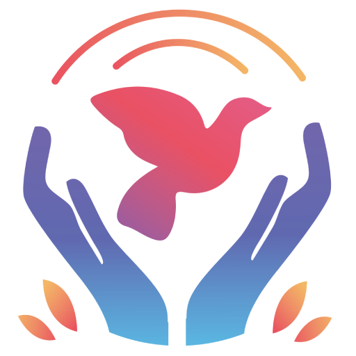

# Ruka-Ljubavi-aplikacija-za-humanitarni-rad

Projekat android aplikacije namijenjene humanitarnom radu "Ruka Ljubavi" za završni rad na Fakultetu informacijskih tehnologija.

BACKEND: REST API C# ASP.NET Core :: https://s93.wrd.app.fit.ba/swagger/index.html 

FRONTEND: Android app using kotlin in Android studio :: https://play.google.com/store/apps/details?id=com.fit.ba.rukaljubavi

© Faculty of Information Technology, University Džemal Bijedić of Mostar
